# A/B Testing on Mobile Game Retention

In this project, I analyzed a real A/B test from the mobile puzzle game Cookie Cats to determine whether moving a game gate from level 30 to level 40 affected player retention. The dataset contains nearly 90,000 players who were randomly assigned to one of two groups — one experiencing the gate at level 30 (control) and the other at level 40 (treatment). I conducted a full power analysis to verify the experiment had sufficient sample size, then evaluated the results using both frequentist hypothesis testing (z-tests, chi-squared tests, and Mann-Whitney U tests) and Bayesian inference (Beta-Binomial modeling with posterior simulation). Both approaches converge on the same conclusion: moving the gate to level 40 reduces 7-day retention, and the control group (gate at level 30) should be kept.

---

## Dataset Overview

The data comes from a real A/B test conducted by the Cookie Cats game development team. Players were randomly assigned to see a forced waiting gate at either level 30 or level 40, and their behavior was tracked over the following two weeks.

| Property | Value |
|----------|-------|
| Total Players | ~90,189 |
| Control Group (gate_30) | ~44,700 |
| Treatment Group (gate_40) | ~45,489 |
| Metrics Tracked | 1-day retention, 7-day retention, game rounds played |
| Observation Period | First 14 days after install |

---

## Exploratory Data Analysis

### Group Sizes

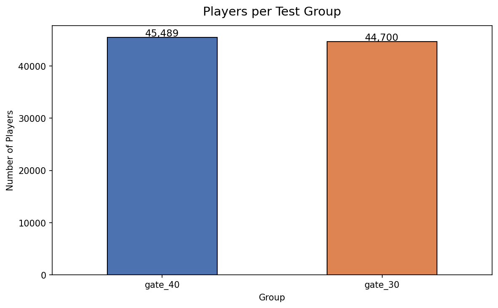

This chart confirms the experiment was properly randomized — each group contains roughly 45,000 players with a near-even 50/50 split. Even group sizes are important because they ensure neither group has a statistical advantage simply due to having more data.

### Retention by Group

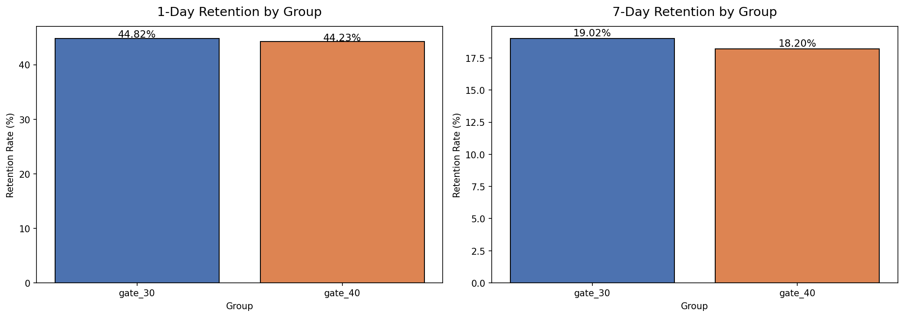

These two charts compare the retention rates between the control (gate_30) and treatment (gate_40) groups. At first glance, the differences appear small — both groups hover around 44-45% for 1-day retention and 18-19% for 7-day retention. However, even small differences in retention can be meaningful at scale. The purpose of the subsequent statistical tests is to determine whether these observed differences are real or just due to random chance.

### Game Rounds Distribution

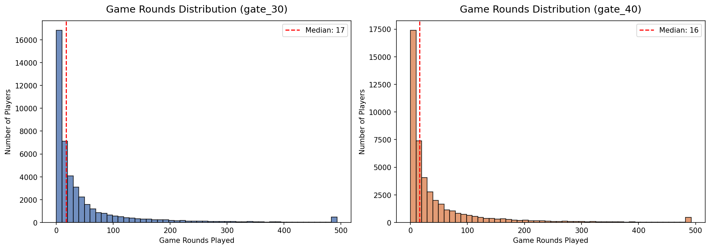

These histograms show how many game rounds players completed in their first 14 days, broken out by group. The distributions are heavily right-skewed — most players play relatively few rounds, while a small number of highly engaged players play hundreds or even thousands. The red dashed line shows the median, which is a more appropriate measure of central tendency than the mean for this type of skewed data.

### Game Rounds Box Plot

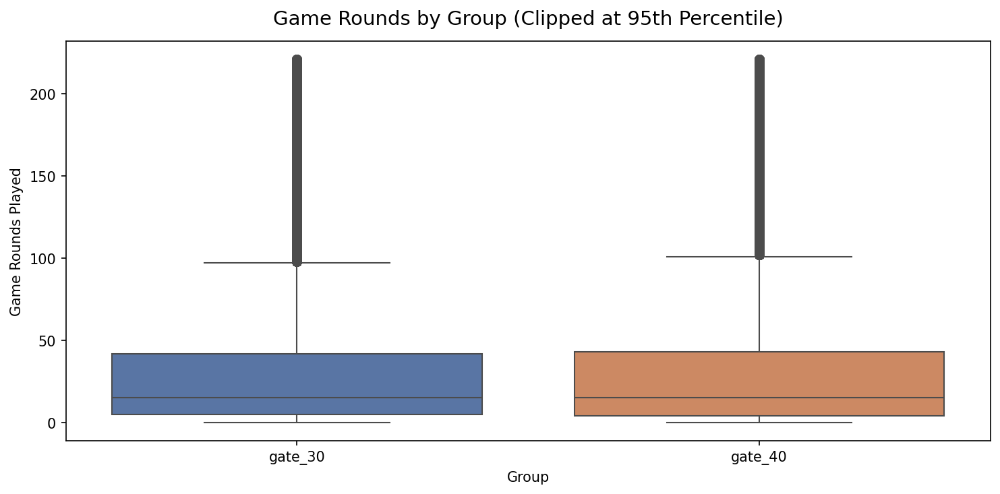

This box plot provides another view of the game rounds distribution, clipped at the 95th percentile to make the comparison clearer. Each box represents the middle 50% of players for that group, with the line inside marking the median. The distributions are very similar between groups, suggesting the gate placement had minimal impact on overall engagement volume.

### Retention vs. Game Rounds

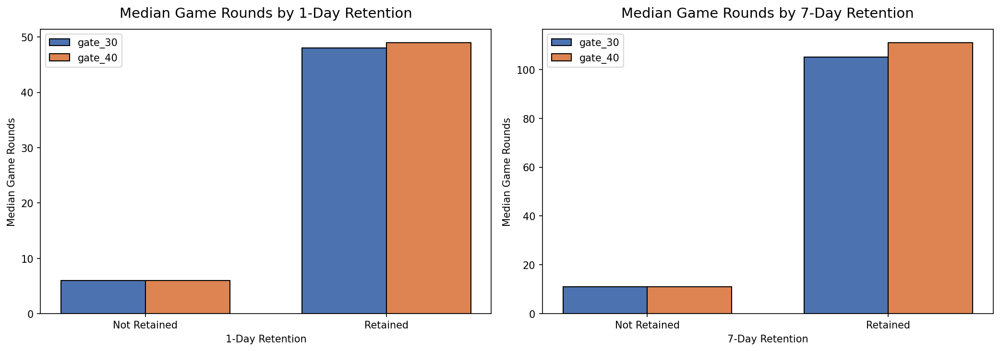

These charts reveal an intuitive pattern: players who came back (retained) played significantly more game rounds than those who did not. This confirms that retention is a meaningful engagement metric — retained players are genuinely more engaged, not just opening the app briefly.

---

## Power Analysis

Before interpreting the test results, I conducted a power analysis to verify whether the experiment had a large enough sample size to detect a meaningful difference. Power analysis answers the question: "If a real effect exists, how likely is this experiment to find it?"

### Key Concepts

| Term | What It Means |
|------|---------------|
| **Statistical Power** | The probability of detecting a real effect when one exists. A standard target is 80%. |
| **Minimum Detectable Effect (MDE)** | The smallest difference in retention rates that the experiment is designed to detect. |
| **Significance Level (alpha)** | The threshold for declaring a result statistically significant. I used the standard 0.05 (5%). |
| **Sample Size** | The number of players per group. More players means more power to detect smaller effects. |

### Sample Size vs. MDE

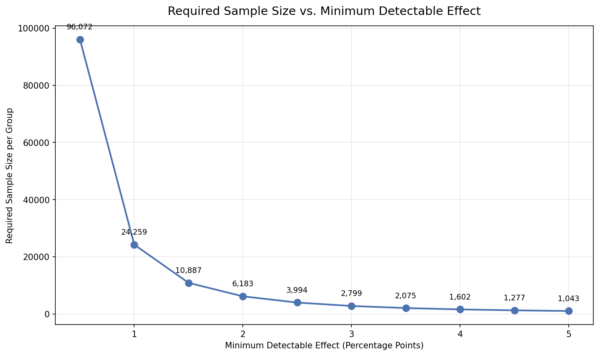

This chart shows the tradeoff between how small an effect I want to detect and how many players I need to detect it. Detecting a 0.5 percentage point difference requires tens of thousands of players per group, while detecting a 5 percentage point difference requires only a few hundred. This is the fundamental planning tool for any A/B test — before running an experiment, I use this curve to decide how long to run it.

### Power vs. Sample Size

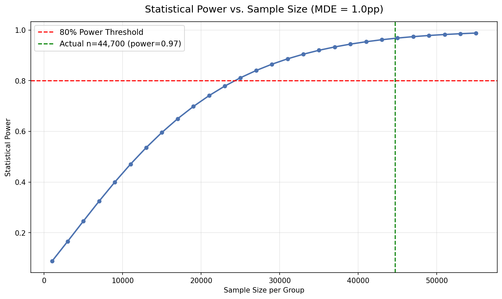

This chart shows how statistical power increases as more players are added. The red dashed line marks the 80% power threshold (the industry standard minimum), and the green dashed line marks the actual sample size in this experiment. With ~45,000 players per group, this experiment is well-powered to detect even small effects of 1 percentage point or more.

### Power vs. Significance Level

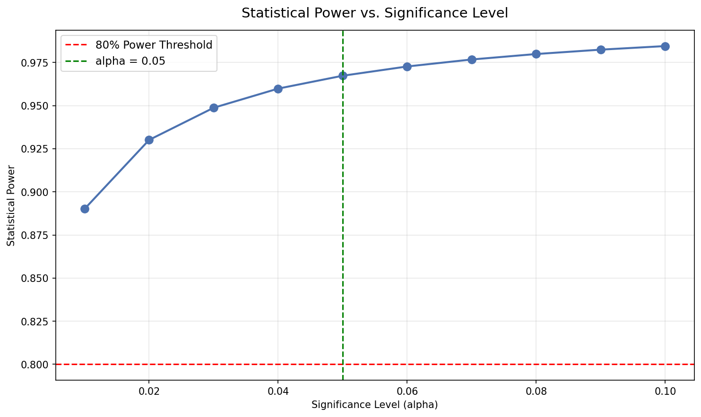

This chart illustrates the relationship between the significance threshold (alpha) and statistical power. A stricter alpha (lower threshold) reduces the chance of a false positive but also reduces power. At the standard alpha of 0.05, this experiment achieves high power given its large sample size.

---

## Frequentist Hypothesis Testing

The frequentist approach asks: "If there were truly no difference between the groups, how likely would I be to observe data this extreme?" If that probability (the p-value) is below 0.05, I reject the null hypothesis and conclude the difference is statistically significant.

### Tests Conducted

| Test | Purpose | When to Use |
|------|---------|-------------|
| **Z-test for proportions** | Compares two proportions (retention rates) directly | When the metric is binary (retained vs. not retained) |
| **Chi-squared test** | Tests independence between group assignment and retention | When data is categorical (a contingency table) |
| **Mann-Whitney U test** | Compares the distributions of game rounds between groups | When the metric is continuous but not normally distributed |

### Confidence Intervals

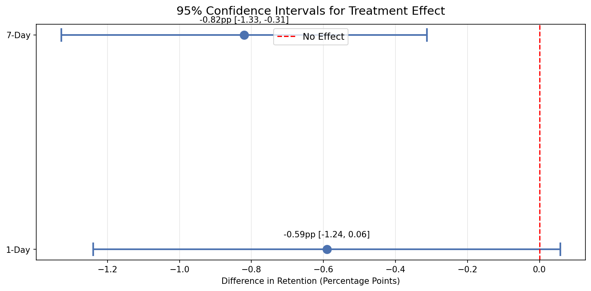

This chart shows the 95% confidence interval for the difference in retention rates between groups. Each horizontal line represents the range of plausible values for the true difference. If the interval crosses zero (the red dashed line), I cannot conclude there is a significant difference. For 7-day retention, the entire confidence interval sits below zero, indicating the treatment group (gate_40) has meaningfully lower retention.

### Retention Rate Comparison

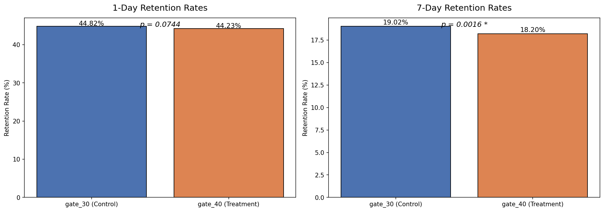

These bar charts show the retention rates side by side with their p-values. The asterisk (*) indicates statistical significance. For 1-day retention, the difference is small and not significant at alpha = 0.05. For 7-day retention, the difference is statistically significant — players who encountered the gate at level 30 were more likely to come back a week later.

### P-value Summary

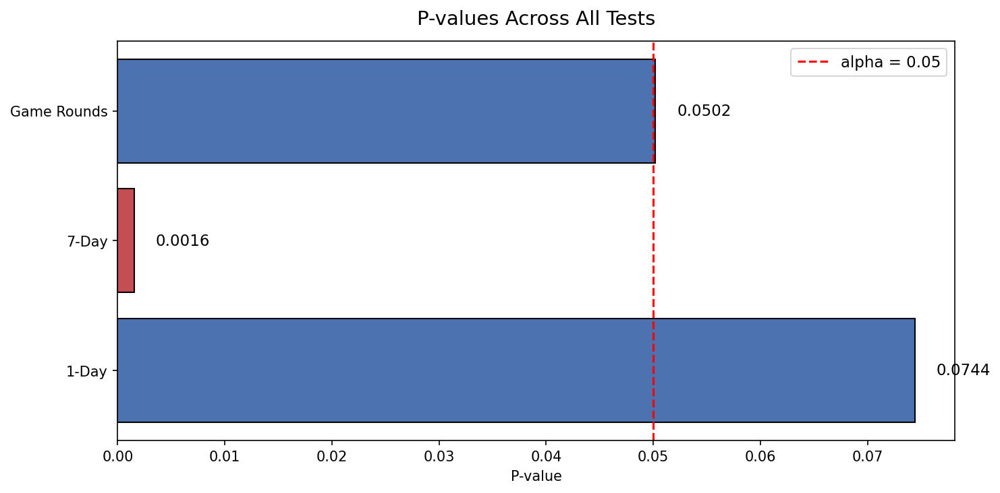

This chart shows p-values for all tests at once. Red bars indicate significant results (p < 0.05) and blue bars indicate non-significant results. The 7-day retention test clearly crosses the significance threshold, reinforcing that the gate placement has a real impact on longer-term retention.

---

## Bayesian A/B Testing

The Bayesian approach asks a fundamentally different question than the frequentist approach: instead of "is the effect zero or not?" it asks "given the data I observed, what is the probability that one group is better than the other?" This produces direct probability statements that are often more intuitive for decision-making.

### How It Works

I modeled each group's retention rate as a Beta distribution — a natural choice for binary outcomes (retained or not retained). Starting from an uninformative prior (Beta(1,1), meaning I assumed no prior knowledge), I updated the distribution with the observed data to get a "posterior" distribution that represents my updated belief about each group's true retention rate. I then drew 100,000 random samples from each posterior and compared them to estimate the probability that one group outperforms the other.

### Posterior Distributions — 1-Day Retention

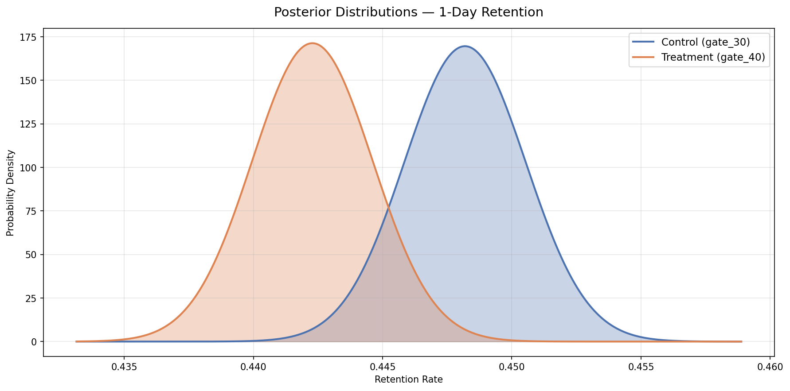

These curves represent my updated belief about each group's true 1-day retention rate after observing all the data. The two distributions overlap substantially, meaning I am not highly confident that the groups differ on this metric. The peak of each curve represents the most likely retention rate for that group.

### Treatment Effect — 1-Day Retention

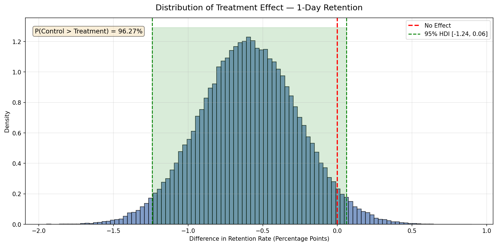

This histogram shows the distribution of the difference between the treatment and control groups across 100,000 simulations. The red dashed line at zero represents "no effect." The green shaded region is the 95% Highest Density Interval (HDI) — the range containing the most plausible values for the true difference. For 1-day retention, the distribution straddles zero, meaning the effect could go either way.

### Posterior Distributions — 7-Day Retention

For 7-day retention, the posterior distributions show a clearer separation between the groups. The control group (gate_30) has a noticeably higher retention rate. This visual separation aligns with the frequentist finding that the difference is statistically significant.

### Treatment Effect — 7-Day Retention

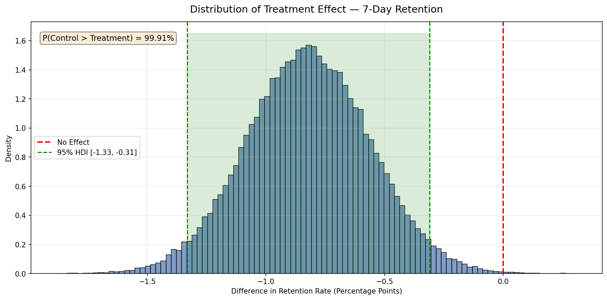

This is the most telling visualization in the Bayesian analysis. The entire distribution of differences sits below zero, and the 95% HDI does not include zero. The annotation shows the probability that the control group has higher retention — a direct, actionable probability statement. Unlike a p-value, which only tells me whether to reject the null hypothesis, this tells me exactly how confident I should be in the control group being better.

### Cumulative Evidence — 7-Day Retention

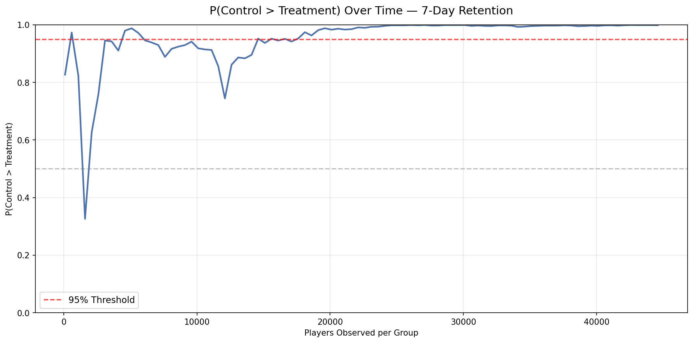

This chart shows how my confidence in the control group being better evolved as more data was collected. Early on, with few players, the probability fluctuates. As more data accumulated, the probability that the control group (gate_30) has higher 7-day retention steadily climbed and stabilized. This type of monitoring is a major advantage of the Bayesian approach — I can track confidence in real time and potentially stop an experiment early if the evidence is overwhelming.

---

## Comparison of Approaches

### Methodology Comparison

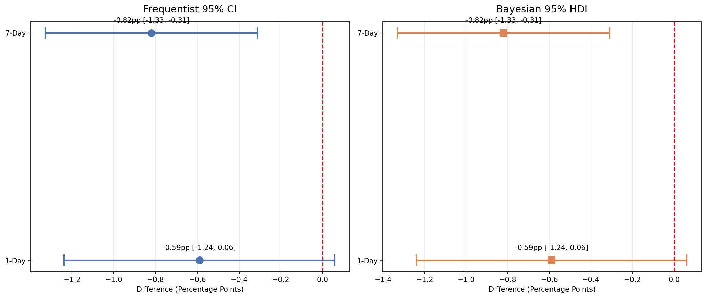

This side-by-side comparison shows how the frequentist confidence intervals (left) and Bayesian highest density intervals (right) tell a consistent story. Both methods agree on the direction and approximate magnitude of the effect for each metric. The key difference is in interpretation: the frequentist CI says "if I repeated this experiment many times, 95% of intervals would contain the true value," while the Bayesian HDI says "there is a 95% probability the true value falls in this range."

### Overall Summary

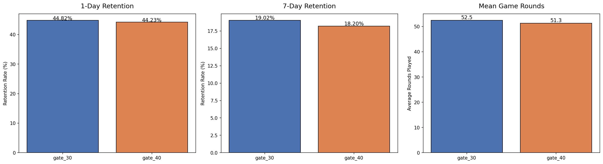

This three-panel chart provides the final summary of all key metrics. The control group (gate_30) shows slightly higher retention at both the 1-day and 7-day marks, with similar overall engagement as measured by mean game rounds. The 7-day retention difference is the most consequential finding.

| Metric | Frequentist Result | Bayesian Result |
|--------|-------------------|-----------------|
| 1-Day Retention | Not significant (p > 0.05) | Inconclusive — probability near 50/50 |
| 7-Day Retention | Significant (p < 0.05) | Strong evidence — high probability control is better |
| Game Rounds | Not significant | N/A |

---

## Key Design Decisions

| Decision | Rationale |
|----------|-----------|
| Cookie Cats dataset | A real, publicly available A/B test with proper randomization — not simulated data. |
| Power analysis before interpretation | Verifying the experiment is properly sized before drawing conclusions prevents under-powered or over-confident results. |
| Both frequentist and Bayesian methods | Most organizations use one or the other. Demonstrating both shows versatility and allows comparison of their strengths. |
| 7-day retention as primary metric | Short-term retention (1-day) captures habitual behavior, but 7-day retention better reflects whether players genuinely enjoy the game enough to return. |
| Uninformative prior (Beta(1,1)) | Starting with no prior assumptions lets the data speak for itself, making the analysis transparent and defensible. |
| Mann-Whitney U test for game rounds | Game rounds are heavily right-skewed and non-normal, making a standard t-test inappropriate. Mann-Whitney is a non-parametric alternative that does not assume normality. |
