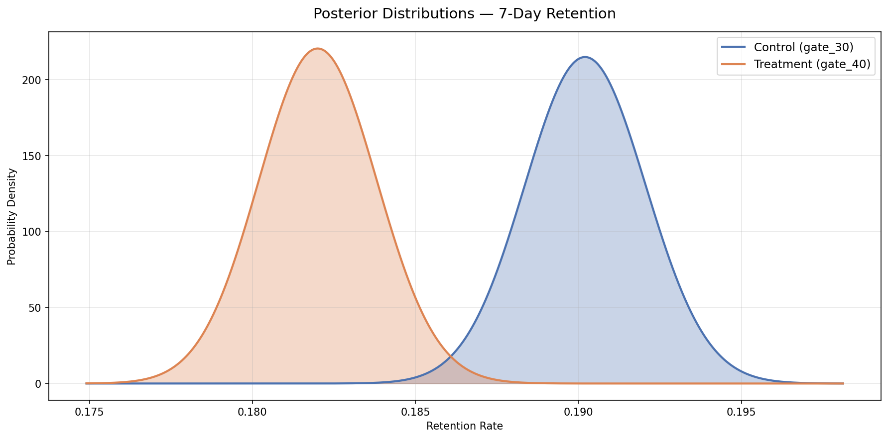

# A/B Testing on Mobile Game Retention

A/B testing is a method I use to compare two versions of something — a product feature, a webpage design, a marketing email — to determine which one performs better. The idea is straightforward: I randomly split users into two groups, show each group a different version, and then measure whether the difference in outcomes is real or just due to random chance. In this project, I analyzed a real A/B test from the mobile puzzle game Cookie Cats, where the game developers wanted to know whether moving a forced pause point (called a "gate") from level 30 to level 40 would affect how many players came back to play the game in subsequent days. I started by verifying the experiment had enough players to detect a meaningful difference (power analysis), then evaluated the results using two complementary statistical approaches: frequentist hypothesis testing and Bayesian inference. Both methods led me to the same conclusion — moving the gate to level 40 reduced 7-day player retention, and the original placement at level 30 should be kept. The techniques I applied here — power analysis, z-tests, confidence intervals, posterior distributions, and cumulative evidence monitoring — are the same ones used across industries to make data-driven decisions in product development, marketing, healthcare, finance, and beyond.

---

## Dataset Overview

The data comes from a real A/B test conducted by the Cookie Cats game development team. Players were randomly assigned to encounter a forced waiting gate at either level 30 (control) or level 40 (treatment), and their behavior was tracked over the following 14 days. A "gate" is a game mechanic that forces the player to either wait for a timer to expire or make an in-app purchase before continuing — it is essentially a paywall. The question the experiment answers is: does it matter when players first encounter that interruption?

| Property | Value |
|----------|-------|
| Total Players | 90,189 |
| Control Group (gate_30) | 44,700 |
| Treatment Group (gate_40) | 45,489 |
| Metrics Tracked | 1-day retention, 7-day retention, game rounds played |
| Observation Period | First 14 days after install |

---

## Exploratory Data Analysis

### Group Sizes

This chart confirms the experiment was properly randomized — the control group contains 44,700 players and the treatment group contains 45,489 players, a near-even 50/50 split. Even group sizes are important because they ensure neither group has a statistical advantage simply due to having more data. If the groups were dramatically unequal, I would need to question whether the randomization process worked correctly.

### Retention by Group

These two charts compare the retention rates between the control and treatment groups. For 1-day retention, gate_30 comes in at 44.82% compared to gate_40 at 44.23% — a difference of about 0.59 percentage points. For 7-day retention, gate_30 shows 19.02% compared to gate_40 at 18.20% — a difference of about 0.82 percentage points. These differences look small at first glance, but with nearly 90,000 players in the experiment, even small differences can turn out to be statistically meaningful. The purpose of the subsequent statistical tests is to determine whether these observed differences reflect a real effect or are just noise from random variation.

### Game Rounds Distribution

These histograms show how many game rounds players completed in their first 14 days, broken out by group. The distributions are heavily right-skewed — most players play relatively few rounds, while a small number of highly engaged players play hundreds or even thousands. The red dashed line shows the median (17 rounds for gate_30, 16 rounds for gate_40), which is a more appropriate measure of "typical" behavior than the mean for this type of skewed data. The mean would be pulled upward by the small number of extreme players.

### Game Rounds Box Plot

This box plot provides another view of the game rounds distribution, clipped at the 95th percentile to make the comparison clearer. Each box represents the middle 50% of players for that group, with the horizontal line inside marking the median. The distributions are very similar between groups, suggesting the gate placement had minimal impact on overall engagement volume — players in both groups played roughly the same amount.

### Retention vs. Game Rounds

These charts reveal an intuitive pattern: players who came back (retained) played significantly more game rounds than those who did not. For 7-day retention, retained players had a median of around 100 game rounds compared to roughly 10 for players who did not return. This confirms that retention is a meaningful engagement metric — retained players are genuinely more engaged with the game, not just briefly opening the app and closing it.

---

## Power Analysis

Before interpreting the test results, I conducted a power analysis to verify whether the experiment had a large enough sample size to detect a meaningful difference. This is a critical step that I always perform before drawing conclusions from any A/B test. Power analysis answers the question: "If a real effect exists, how likely is this experiment to find it?"

### Key Concepts

| Term | What It Means |
|------|---------------|
| **Statistical Power** | The probability of detecting a real effect when one exists. I target a minimum of 80%, which is the industry standard. |
| **Minimum Detectable Effect (MDE)** | The smallest difference in retention rates that the experiment is designed to detect. I set this at 1 percentage point. |
| **Significance Level (alpha)** | The threshold for declaring a result statistically significant. I used the standard 0.05 (5%), meaning I accept a 5% chance of a false positive. |
| **Sample Size** | The number of players per group. More players means more power to detect smaller effects. |

### Sample Size vs. MDE

This chart shows the tradeoff between how small an effect I want to detect and how many players I need to detect it. Detecting a 0.5 percentage point difference requires about 96,000 players per group, while detecting a 5 percentage point difference requires only about 1,000. This is the fundamental planning tool for any A/B test — before running an experiment, I use this curve to determine how long to run it based on the expected traffic volume and the smallest effect size that would be practically meaningful.

### Power vs. Sample Size

This chart shows how statistical power increases as more players are added to each group. The red dashed line marks the 80% power threshold (the industry standard minimum), and the green dashed line marks the actual sample size in this experiment — 44,700 players per group. At this sample size, the experiment achieves 97% power for detecting a 1 percentage point difference, well above the 80% minimum. This means I can be confident that if a real difference of 1 percentage point or larger exists, this experiment had a very high chance of finding it.

### Power vs. Significance Level

This chart illustrates the relationship between the significance threshold (alpha) and statistical power. A stricter alpha (lower value) reduces the chance of a false positive but also reduces power — there is always a tension between these two goals. At the standard alpha of 0.05, this experiment achieves approximately 97% power, and even at a very strict alpha of 0.01, power remains above 89%. This tells me the experiment is robust regardless of which significance threshold I choose.

---

## Frequentist Hypothesis Testing

The frequentist approach is the traditional method for analyzing A/B tests. It asks: "If there were truly no difference between the groups, how likely would I be to observe data this extreme?" If that probability (called the p-value) falls below 0.05, I reject the assumption of no difference and conclude the effect is statistically significant.

### Tests I Conducted

| Test | Purpose | When I Use It |
|------|---------|---------------|
| **Z-test for proportions** | Compares two proportions (retention rates) directly | When the metric is binary — each player either came back or did not |
| **Chi-squared test** | Tests whether group assignment and retention are independent | When I want to confirm the z-test result using a different method on the same categorical data |
| **Mann-Whitney U test** | Compares the distributions of game rounds between groups | When the metric is continuous but not normally distributed — game rounds are heavily right-skewed, so a standard t-test would be inappropriate |

### Confidence Intervals

This chart is one of the most important outputs from the frequentist analysis. Each horizontal line represents the 95% confidence interval for the difference in retention between the treatment and control groups. The dot in the middle is the observed difference, and the line extends to the range of plausible values. The red dashed line at zero represents "no effect." If the entire interval sits on one side of zero, I can conclude there is a significant difference. For 7-day retention, the interval runs from -1.33 to -0.31 percentage points — entirely below zero — meaning I am confident the treatment group (gate_40) has lower retention. For 1-day retention, the interval runs from -1.24 to +0.06, which barely crosses zero, so I cannot confidently conclude there is a difference.

### Retention Rate Comparison

These bar charts show the retention rates side by side with their p-values displayed at the top. The asterisk (*) next to the 7-day retention p-value indicates statistical significance. For 1-day retention, the p-value of 0.0744 is above the 0.05 threshold, meaning the 0.59 percentage point difference could plausibly be due to random chance. For 7-day retention, the p-value of 0.0016 is well below the threshold, meaning there is strong evidence that the 0.82 percentage point difference is real and not due to chance.

### P-value Summary

This chart summarizes the p-values for all three tests at once. The red dashed line marks the significance threshold (alpha = 0.05). The red bar for 7-day retention (p = 0.0016) sits far to the left of the threshold, indicating strong significance. The blue bars for 1-day retention (p = 0.0744) and game rounds (p = 0.0502) both fall just to the right of the threshold — close but not significant. This pattern tells a clear story: the gate placement primarily affects longer-term retention rather than immediate next-day behavior or total play volume.

---

## Bayesian A/B Testing

The Bayesian approach asks a fundamentally different question than the frequentist approach. Instead of "is the effect zero or not?" it asks "given the data I observed, what is the probability that one group is better than the other?" This produces direct probability statements — such as "there is a 99.91% chance the control group has higher 7-day retention" — which are often more intuitive for stakeholders and decision-makers.

### How It Works

I modeled each group's retention rate using a Beta distribution — a natural choice for binary outcomes where each player either came back or did not. I started with an uninformative prior, Beta(1,1), which assumes no prior knowledge about what the retention rate might be. I then updated each distribution with the observed data to produce "posterior" distributions representing my updated belief about each group's true retention rate. Finally, I drew 100,000 random samples from each posterior and compared them to estimate the probability that one group outperforms the other.

### Posterior Distributions — 1-Day Retention

These curves represent my updated belief about each group's true 1-day retention rate after observing all 90,189 players. The blue curve (control, gate_30) peaks around 0.448 and the orange curve (treatment, gate_40) peaks around 0.442. The two distributions overlap substantially — meaning while the control group appears slightly better, I am not highly confident the groups truly differ on this metric. The overlap is the visual equivalent of the frequentist result being non-significant.

### Treatment Effect — 1-Day Retention

This histogram shows the distribution of the difference between the treatment and control groups across 100,000 simulated scenarios. The red dashed line at zero represents "no effect," and the green shaded region is the 95% Highest Density Interval (HDI) — the range containing the most plausible values for the true difference, which spans from -1.24 to +0.06 percentage points. Because this interval includes zero, I cannot rule out the possibility of no effect. However, the annotation shows that in 96.27% of simulations the control group had higher retention — suggestive, but not conclusive enough to act on.

### Posterior Distributions — 7-Day Retention

For 7-day retention, the posterior distributions tell a much clearer story. The control group (gate_30, blue) peaks around 0.190 and the treatment group (gate_40, orange) peaks around 0.182. There is very little overlap between the curves — visually, I can see that the control group's distribution sits clearly to the right of the treatment group's. This separation means I can be quite confident that the control group genuinely has higher 7-day retention.

### Treatment Effect — 7-Day Retention

This is the most telling visualization in the entire analysis. The entire distribution of differences sits to the left of zero, and the 95% HDI ranges from -1.33 to -0.31 percentage points — it does not include zero. The annotation shows that in 99.91% of simulations, the control group had higher 7-day retention. Unlike a p-value, which only tells me whether to reject a null hypothesis, this gives me a direct, actionable probability: I am 99.91% confident that keeping the gate at level 30 results in better 7-day retention than moving it to level 40.

### Cumulative Evidence — 7-Day Retention

This chart shows how my confidence in the control group being better evolved as more data was collected. Early on, with only a few hundred players, the probability fluctuated wildly — sometimes favoring the control group, sometimes the treatment. As more players were observed, the probability that the control group has higher 7-day retention steadily climbed and stabilized well above the 95% threshold (red dashed line). This type of real-time monitoring is a major advantage of the Bayesian approach — in a live experiment, I could use this to decide when enough evidence has accumulated to stop the test early, potentially saving time and limiting exposure to the worse-performing variant.

---

## Comparison of Approaches

### Methodology Comparison

This side-by-side comparison shows how the frequentist confidence intervals (left) and Bayesian highest density intervals (right) tell a consistent story. Both methods estimate the same magnitude of effect for each metric, and both agree that the 7-day retention difference is meaningful while the 1-day retention difference is inconclusive. The key difference lies in interpretation: the frequentist CI says "if I repeated this experiment many times, 95% of intervals would contain the true value," while the Bayesian HDI says "there is a 95% probability the true value falls in this range." In practice, both lead me to the same decision.

### Overall Summary

This three-panel chart provides the final summary of all key metrics. The control group (gate_30) shows higher retention at both the 1-day mark (44.82% vs. 44.23%) and the 7-day mark (19.02% vs. 18.20%), with similar overall engagement as measured by mean game rounds (52.5 vs. 51.3). The 7-day retention difference is the most consequential finding — it represents the strongest evidence that the gate placement has a real impact on player behavior.

| Metric | gate_30 (Control) | gate_40 (Treatment) | Frequentist Result | Bayesian Result |
|--------|-------------------|---------------------|--------------------|-----------------|
| 1-Day Retention | 44.82% | 44.23% | Not significant (p = 0.0744) | 96.27% chance control is better |
| 7-Day Retention | 19.02% | 18.20% | Significant (p = 0.0016) | 99.91% chance control is better |
| Game Rounds (mean) | 52.5 | 51.3 | Not significant (p = 0.0502) | N/A |

My recommendation based on this analysis is to keep the gate at level 30. The data shows that players who encounter the gate earlier are more likely to return to the game a week later. One theory is that the earlier interruption creates a natural stopping point that prevents players from binging and burning out, building a habit of returning instead. Regardless of the underlying mechanism, the statistical evidence is clear: the original design outperforms the proposed change.

---

## Key Design Decisions

| Decision | Rationale |
|----------|-----------|
| Cookie Cats dataset | I chose a real, publicly available A/B test with proper randomization rather than simulated data, because demonstrating competence on real-world experiments is more convincing than working with artificial examples. |
| Power analysis before interpretation | I always verify an experiment is properly sized before drawing conclusions. This prevents under-powered experiments from producing misleading "not significant" results and prevents over-confident claims from experiments that are too small. |
| Both frequentist and Bayesian methods | Most organizations rely on one or the other. I demonstrated both to show versatility and to illustrate how they complement each other — frequentist methods provide familiar p-values and confidence intervals, while Bayesian methods produce direct probability statements that are easier for non-technical stakeholders to interpret. |
| 7-day retention as primary metric | Short-term retention (1-day) captures habitual behavior, but 7-day retention better reflects whether players genuinely enjoy the game enough to return over time. It is a stronger signal of long-term engagement and lifetime value. |
| Uninformative prior Beta(1,1) | Starting with no prior assumptions lets the data speak for itself, making the Bayesian analysis transparent and defensible. Anyone reviewing this work can see that my conclusions are driven entirely by the observed data, not by subjective prior beliefs. |
| Mann-Whitney U test for game rounds | Game rounds are heavily right-skewed and non-normal, so a standard t-test would be inappropriate. The Mann-Whitney U test is a non-parametric alternative that compares distributions without assuming normality. |
